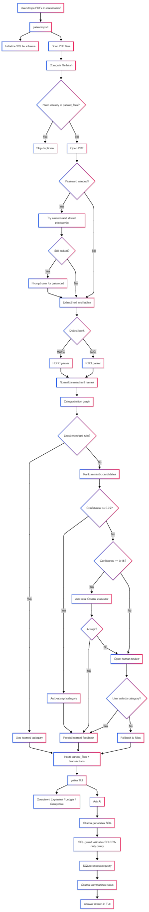

# Paisa Architecture

## Purpose

Paisa is a local-first personal finance workflow for bank-statement ingestion, transaction categorization, dashboard analytics, and local AI Q&A. Core input is HDFC and ICICI PDF statements. Core storage is SQLite. Optional AI runs through local Ollama.

## Operating Model

- User keeps PDFs in local `statements/`
- CLI imports statements into local SQLite
- TUI reads same SQLite database for dashboards and editing
- Categorization learns from past corrections
- Ask AI never writes data; only validated `SELECT` queries run
- No cloud dependency in normal flow; Ollama stays local

## End-To-End Flow

### 1. Startup

- `paisa` loads `.env` from current working directory
- Settings resolve statement folder and database path
- Database initialization creates tables and starter categories

### 2. Statement import

- `paisa import` scans `statements/*.pdf`
- Each file gets hashed
- Duplicate hashes skip immediately through `parsed_files`
- Importer tries plain open, session passwords, stored passwords, then prompt password
- Passwords can persist through secure keyring plus local Fernet key

### 3. PDF parsing

- `pdfplumber` extracts text and tables
- Bank detection checks statement text
- HDFC parser reads table rows, dates, debit/credit columns, balances, narration continuations
- ICICI parser prefers tables, then falls back to text-line parsing with balance-based credit/debit inference
- Merchant cleaner strips payment noise like UPI refs, txn ids, IMPS/NEFT markers

### 4. Categorization

- Exact learned merchant rule checked first
- If no exact rule, service ranks categories from learned examples, starter keyword hints, and local embedding similarity when `sentence-transformers` is installed
- If confidence >= `0.72`, suggestion auto-accepts
- If confidence between `0.45` and `0.72`, Ollama may accept or request review
- If confidence is low, human review modal opens
- If review skipped or no better choice exists, category falls back to `Misc`
- Accepted outcomes write feedback into `merchant_category_rules` and `categorization_examples`

### 5. Database write

- Import records file metadata in `parsed_files`
- Transactions insert into `transactions`
- Categories live in `categories`
- Import is transactional; file record and transactions commit together

### 6. TUI analytics

- `Overview` shows balance, monthly income, monthly expenses, recent activity, rolling 30-day balance
- `Expenses` filters debit spend by timeframe and bank; excludes categories whose name starts with `Invest`
- `Ledger` supports local search, transaction edits, AI recategorization of visible debit rows
- `Categories` manages category names and blocks deleting used categories or renaming/deleting `Misc`

### 7. Ask AI

- User asks question in TUI
- `ChatService` asks Ollama for SQL only
- SQL guard strips fences/labels and rejects non-`SELECT`, comments, multi-statement, and mutation keywords
- SQLite query runs with row cap
- Result goes back to Ollama for concise natural-language answer
- Screen shows answer plus executed SQL in status

## Data Model

Main tables:

- `categories`: user and default categories
- `transactions`: imported ledger rows with bank, date, narration, merchant, amount, type, running balance, category
- `parsed_files`: file-hash dedupe registry
- `merchant_category_rules`: latest learned merchant-to-category mapping
- `categorization_examples`: historical examples for semantic matching

Derived behaviors:

- Current balance prefers latest per-bank running balance; falls back to signed transaction totals
- Monthly expenses exclude investment-like categories
- Expense charts group by category or bank
- Recent transactions sort by date, then creation time

## User Workflow

### Normal path

1. Drop PDFs into `statements/`
2. Run `paisa import`
3. Run `paisa`
4. Inspect `Overview` and `Expenses`
5. Fix merchants/categories in `Ledger`
6. Add or clean categories in `Categories`
7. Ask questions in `Ask AI`

### Correction-learning path

1. Open `Ledger`
2. Edit merchant name or category on a row
3. App stores new merchant rule and example
4. Future imports reuse that learned mapping automatically

## Limits

- Supported banks: HDFC, ICICI
- Statement source: PDF only
- AI Q&A needs local Ollama
- Semantic embedding boost needs optional `.[ai]` install
- Password-protected PDFs need usable secure keyring backend for stored password reuse

## Methodology Diagram

